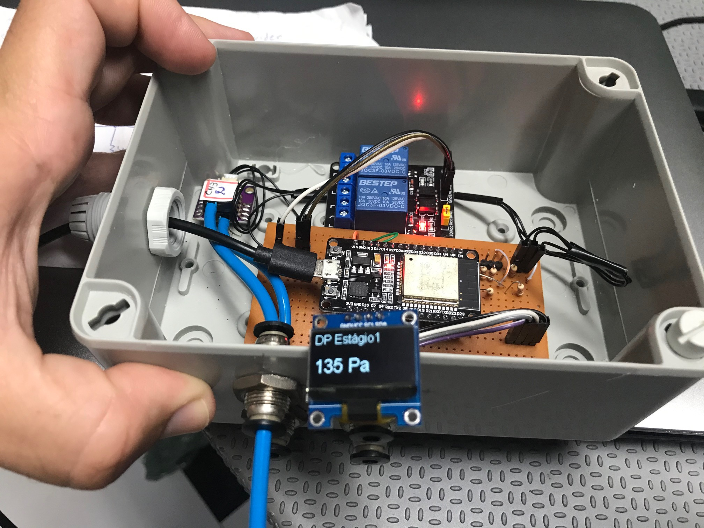
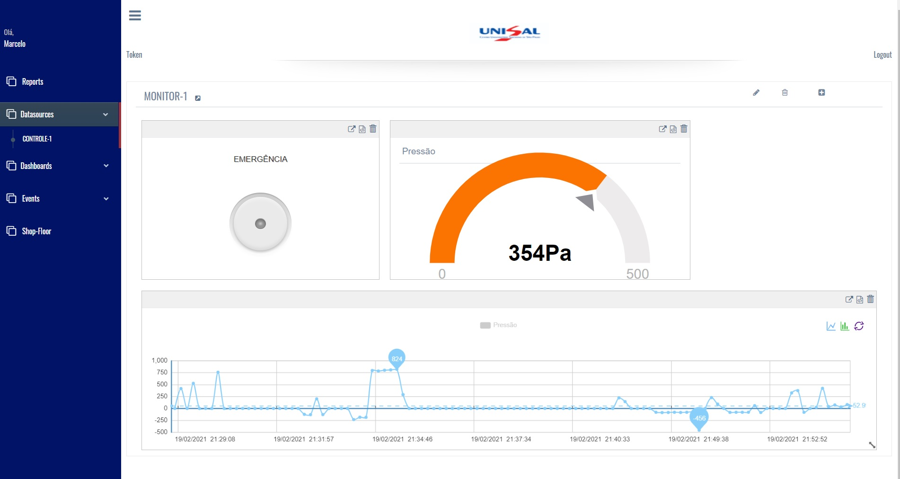

# ATIVIDADE FINAL - MEDIDOR DE PRESSÃO IOT
Autores: 
 - Marcelo Domingues de Souza 
 - Fernando Henrique Dorigan
 - João Vitor Rodrigues de Lima

Professor: 
- Fábio Souza 
Disciplina: Sistemas Operacionais e RTOS de Sistemas Embarcados
Instituição: Universidade Salisiana São José

## Introdução
O projeto utiliza o FREERTOS aplicado ao microcontrolador ESP32. O ESP32 realizada leituras constantes de um sensor de pressão diferencial conectado ao canal analógico CH0, onde os valores adquiridos são enviados para um display OLED (Interface local) através de comunicação I2C e também para uma plataforma na nuvem. A pressão é monitorada em tempo real com armazenamento de dados na nuvem e possui um alarme para pressão alta e também um botão de emergência acionado pela plataforma na nuvem para acionamento de um relé.

## Materiais e Recursos
ESP32,
Relay 3,3V, 
Sensor de Pressão MPX2010DP

## Esquema Elétrico

## Código fonte
Código Adicionado no GitHub

## Explicação do código Fonte
Explicação sobre os principais pontos do código adicionado no código

## Conclusão
Conclusão sobre o projeto e sobre o uso de FreeRTOS.
O projeto contribuiu para o aprendizado das principais funções, estruturas e api categories do freertos.
Também demonstrou a importância de trabalhar com plataforma Multicore para projetos embarcados.
O FreeRtos é uma ferramenta muito poderosa para o desenvolvimento de projetos embarcados e possui excelente conteúdo para pesquisa.

## Referências
Materiais da aula
https://www.freertos.org/
https://www.embarcados.com.br/
https://randomnerdtutorials.com/guide-for-oled-display-with-arduino/

## Licença do projeto
Licença de publicação do projeto. Anexar a licença ao repositório.
